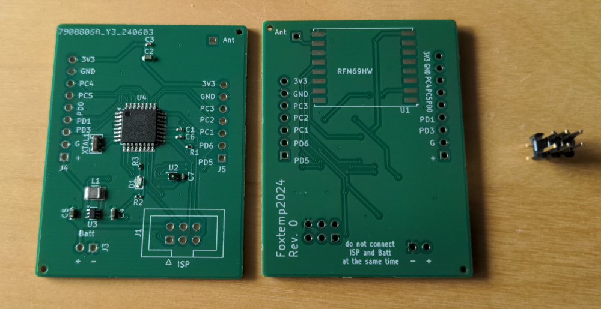
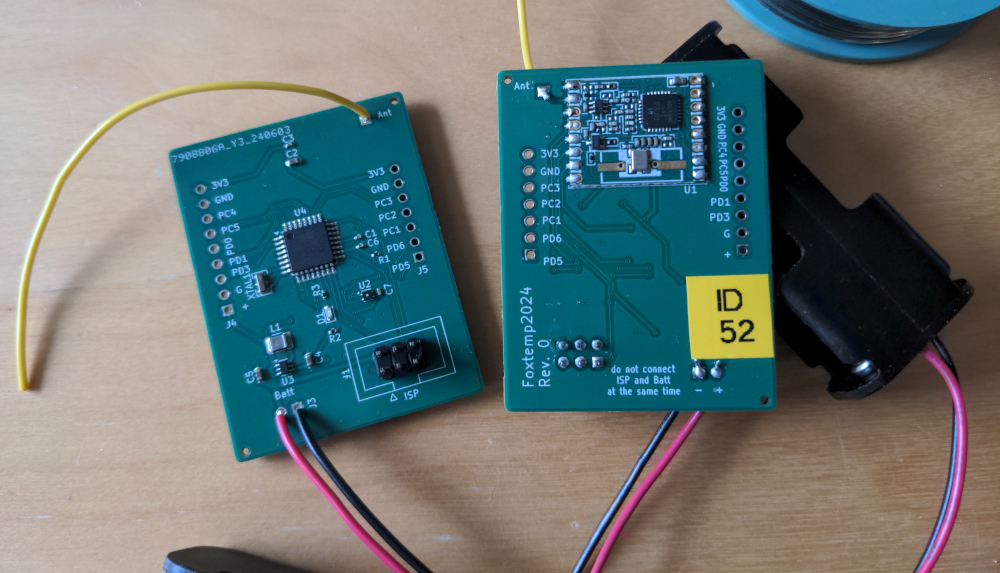

# FoxTemp 2024

## Intro

The goal of the FoxTemp2024 project is to develop a wireless,
battery powered temperature- and humidity sensor. Wireless in
this case does NOT mean WiFi, but using the 868 MHz ISM band.

This is just the next iteration in a series of very similiar devices, the
previous ones being FoxTemp2022 and FoxTemp2016. The main change
from FoxTemp2022 is that this new iteration does not use
ready made building blocks and just sticks them together,
instead it uses a custom made PCB, designed so that the
design can be sent to a cheap manufacturer that produces
the PCB _and_ already solders most parts on for you.

This project started, because less than a year after constructing
FoxTemp2022 because the parts for FoxTemp2016 were becoming very
painful to source, the main part for FoxTemp2022 (which was a
"Moteino" clone) became unavailable as well.
I then (of course) also wanted a better sensor-chip, namely a
SHT45, but I was unable to find a source for a breakout board
with the 'protective membrane included' variant of
it (SHT45-AD1F). Breakout boards with the other variant
(SHT45-AD1B) were available, but seemed prohibitively expensive
for what they delivered. At the same time, others told me about
chinese PCB prototype assembly manufacturers, that would create
prototypes with the components already soldered on, at
very reasonable prices. I also wanted to finally learn KiCAD.

## Status

In May/June 2024, a "Revision 0" has been designed, targetting
JLCPCB as the manufacturer (meaning it uses parts that that
company had in stock in June 2024), and successfully
produced there. And it actually worked very well.
There is no case-design for this revision.

In August 2024, a "Revision 1" was designed.

## Hardware

The hardware design is very similiar to FoxTemp2022.
At the core is an ATmega328P microcontroller, and the
module used for the 868 MHz wireless link is an
RFM69HW - just like in FoxTemp2022. The main difference
is really that it's all integrated onto a purpose-built
board and manufactured by a factory.

Most parts should already be soldered on, except:
* the RFM69HW needs to be soldered to the back of the board
* a wire antenna needs to be soldered on
* a 3x2 ISP pin header needs to be soldered in
* a battery holder needs to be connected (by soldering on the wires coming from it)

The first of the following picture shows how the boards
looked like when they arrived from the factory. As you can
see, most components are on the front of the board (left
in the picture), and already soldered on. You can also see why
you really would not want to hand-solder the SHT45 - it's
the chip labeled "U2": size 1.5x1.5mm...
The second picture then show the completely assembled thing,
with the handsoldered parts soldered on.

The board has some additional holes for pin headers on the
side that bring out power and unused pins from the
microcontroller. That could e.g. be used to attach additional
sensors. That would naturally require firmware modifications.

Power usage should be pretty low - first measurements show
0.02 mA at 2.8V (this will very much depend on the voltage)
while the device is in deep sleep (which it is most of the
time). Comparing that to FoxTemp2016, it is a bit less,
but on the other hand, the more powerful radio module
will use more power while actually transmitting data.
It is currently completely unknown how long this can
last with one set of batteries, and whether it's longer
or shorter than the roundabout 5 years that FoxTemp2016
managed.

### Revision 1

Revision 1 has the following main changes compared
to Rev. 0:
* XTAL1 was dropped, the internal oscillator of the AVR
  is good enough as we do not do anything timing-critical.
* The battery holder was changed from one attached
  with wires to one that is soldered onto the bottom
  of the board. Due to this, the outline of the PCB and
  the placement of components was changed completely,
  so that it now fits above the battery holder well.
  There is just a small part of the PCB
  protruding over the battery holder, not because more
  space was needed, but because the ISP connectors
  need space on the bottom of the PCB - and there is
  none where the battery holder is tightly clinging
  to the bottom of the PCB
* added alternative TagConnect ISP connector
* The boost converter was changed from a LTC3525 to
  a MAX17224. This should be more efficient and
  thus increase battery life.

## Firmware

The way this was designed, the FoxTemp2022 firmware
simply works without modifications after you set the AVRs
fuses correctly. You can also instead compile the firmware
in Foxtemp2024-mode, that enables some (minor) additional power
savings for FoxTemp2024, but would not work on the FoxTemp2022
hardware.

All firmware development happens in the
[FoxTemp2022 repository](https://github.com/poempelfox/foxtemp2022),
and not here. Just get the firmware from there.

